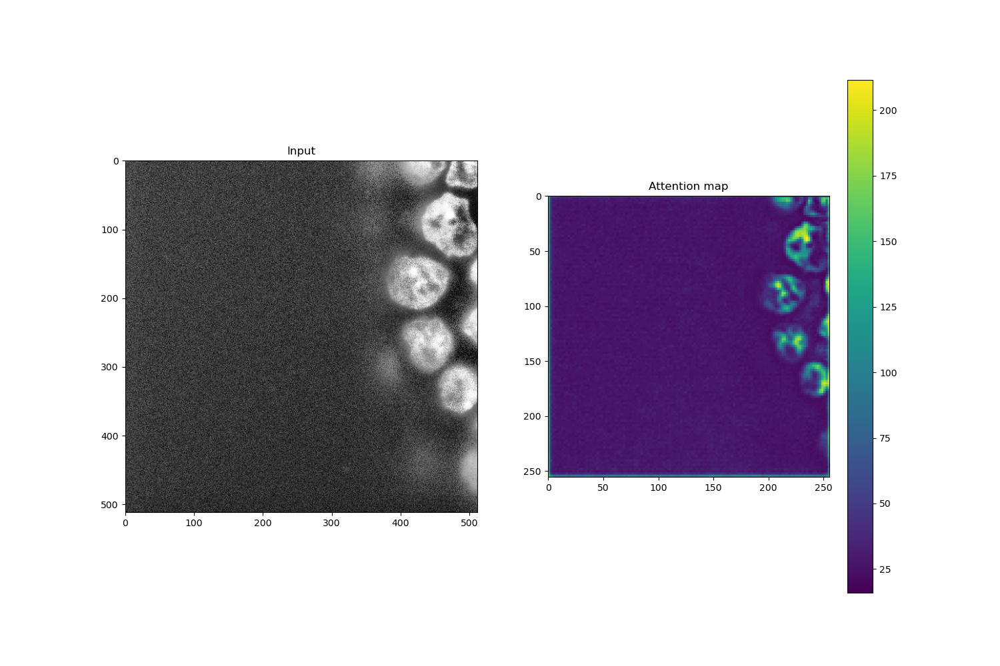
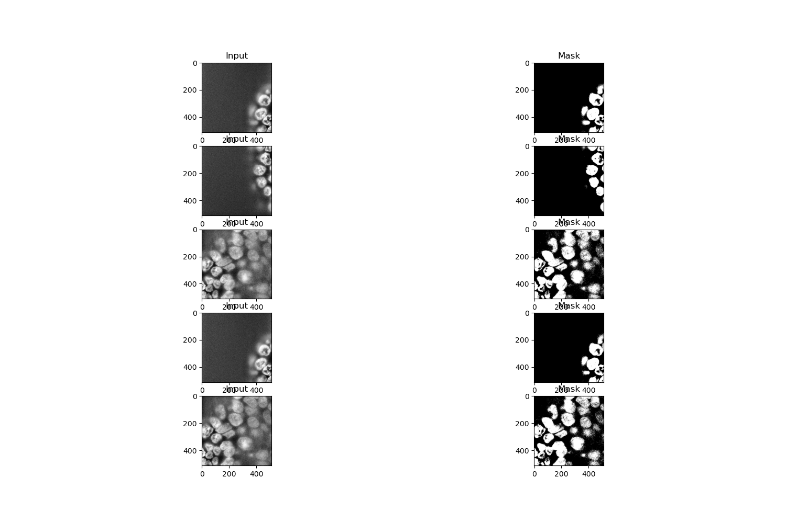

# Attention_Unet
 
[](https://github.com/EdgarLefevre/Attention_Unet/blob/main/LICENSE)

Implementation of attention Unet [Attention U-Net:
Learning Where to Look for the Pancreas].

## Installation

```shell
conda env create -f env.yml
```

## Usage

```shell
python -m Attention_Unet.train
```

## Results 

Attention map :


Prediction :


## TODOs

 - [ ] bug unet ++ with attention (layer names)
 - [ ] postprocessing